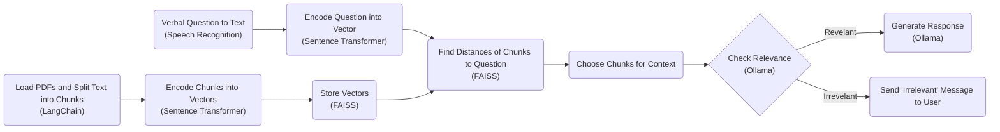

# Rag Agent

## Overview

將 `pdfs` 中的資料儲存成 vector embeddings，在使用者輸入問題時便能根據問題的 embeddings 搜尋相關的上下文，再參考上下文中的內容生成問題的回覆。



## Installation

1. 安裝 [ollama](https://ollama.com/)
2. 執行 `ollama pull llama3`
3. 執行 `pip install -r requirements.txt`
4. 執行 `sudo apt-get install ffmpeg`
5. 執行 `sudo apt install nginx`
6. 創建並修改設定 `vim /etc/nginx/sites-available/<app-name>`
```
server {
    listen 443 ssl;
    server_name <domain-name>;

    ssl_certificate <certificate-path>;
    ssl_certificate_key <certificate-key-path>;

    location / {
        proxy_pass http://127.0.0.1:5000;
        proxy_set_header Host $host;
        proxy_set_header X-Real-IP $remote_addr;
        proxy_set_header X-Forwarded-For $proxy_add_x_forwarded_for;
        proxy_set_header X-Forwarded-Proto $scheme;
    }
}

server {
    listen 80;
    server_name <domain-name>;
    return 301 https://$host$request_uri;
}
```
7. 啟用設定 `sudo ln -s /etc/nginx/sites-available/<app-name> /etc/nginx/sites-enabled/`

## Execution

1. 執行`sudo systemctl start nginx`
2. 執行`gunicorn --bind 127.0.0.1:5000 app:app`